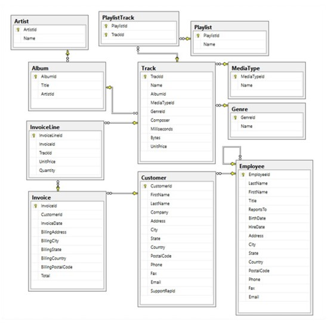
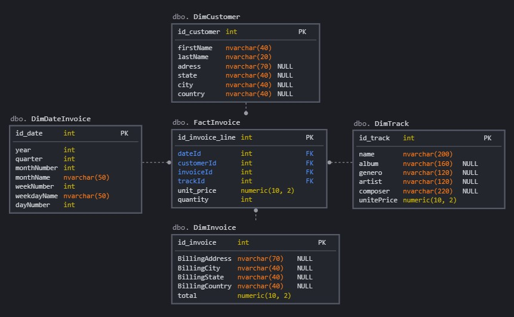
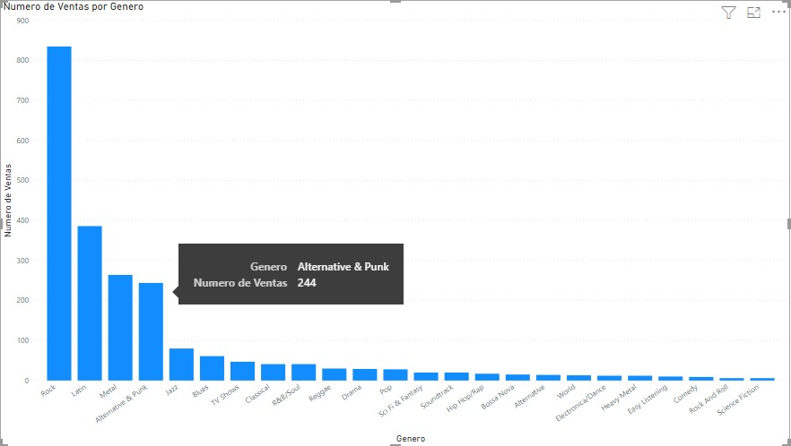

# Proyecto de Analysis Services 
Este proyecto es una simple demostracion de como puede generarse un analisis de datos como apoyo a la toma de decisiones, aqui se encuentra el desarrollo de un proceso [ETL](https://en.wikipedia.org/wiki/Extract,_transform,_load), un [Cubo OLAP](https://es.wikipedia.org/wiki/Cubo_OLAP) y la generacions de un informe en [Power BI](https://es.wikipedia.org/wiki/Power_BI). 

## Tecnologias Usadas

* Visual Studio 2019 Community
* SQLServer 2012 Standar Edition
* Power BI

## Origen de Datos 

Los datos usados provienen de la base de datos de prueba [Chinook](https://github.com/lerocha/chinook-database),
esta es una base de datos de ejemplo sobre una tienda de venta de musica tiene soporte para direfentes gestores de base de datos como SQL Server, Oracle, MySQL, etc.

## Desarrollo

### Diagrama Entidad Relacion Original Chinook

Script de base de datos: [Chinook](./SQL/Chinook.sql).

### Diagrama Data Warehouse

Script de Data Warehouse: [DW-Chinook](./SQL/DW-Chinook.sql).
Script de Data Warehouse con Datos: [DW-Chinook-With-data](./SQL/DW-Chinook-FullData.sql).

### Ejemplo de Reportes 

En este reporte podemos ver las ventas por cada genero musical. 

